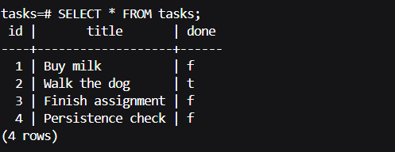

# Task API (Postgres + Docker)

A CRUD API for managing a to-do list, built with Node.js and Express, backed by a PostgreSQL database running in Docker. This is the third storage swap in the FlyRank Backend Track — after in-memory (Week 1) and SQLite (Week 2) — the whole stack (app + database) now starts with a single command.

## Run everything with one command

```bash
git clone <this-repo-url>
cd todo-api-postgres
cp .env.example .env
docker compose up
```

The API will be available at `http://localhost:3000`.

On first run, `docker compose` builds the app image, starts a Postgres container, creates the `tasks` table if it doesn't exist, and seeds three example tasks — but only if the table is empty, so restarting never duplicates them.

## Environment variables

Copy `.env.example` to `.env` before running — see that file for the required variable (`DATABASE_URL`). The example file's values already match `compose.yaml`'s configuration, so no changes are needed to run the project locally.

## Endpoints

| Method | Path | Description |
|---|---|---|
| GET | `/` | API info |
| GET | `/health` | Health check |
| GET | `/tasks` | List all tasks |
| GET | `/tasks/:id` | Get one task |
| POST | `/tasks` | Create a task |
| PUT | `/tasks/:id` | Update a task |
| DELETE | `/tasks/:id` | Delete a task |

All endpoints behave identically to the Week 1 (in-memory) and Week 2 (SQLite) versions — only the storage underneath changed, this time to a containerized Postgres database.

## Example Request

```
curl -i http://localhost:3000/tasks 
HTTP/1.1 200 OK
X-Powered-By: Express
Content-Type: application/json; charset=utf-8
Content-Length: 186
ETag: W/"ba-/OBgBnHN3C8cNCAS2nwUptLyKzU"
Date: Tue, 18 Aug 2026 08:09:50 GMT
Connection: keep-alive
Keep-Alive: timeout=5

[{"id":1,"title":"Buy milk","done":false},{"id":2,"title":"Walk the dog","done":true},{"id":3,"title":"Finish assignment","done":false},{"id":4,"title":"Persistence check","done":false}]
```


## Persistence proof

Tasks survive not just an app restart, but a full stack teardown. To verify: create a task, then run `docker compose down` followed by `docker compose up` — the task is still there, because the named volume (`taskdata`) keeps the data even though both containers are removed and recreated.

## Viewing the database directly

```bash
docker exec -it <db-container-name> psql -U postgres -d tasks
```
Then run `\dt` to list tables, or `SELECT * FROM tasks;` to see the rows.



## Why Docker + Postgres

Postgres runs as its own containerized server rather than a single file (as in Week 2's SQLite version) — this is the same kind of database engine used by real production backends. Docker means no one needs to install Postgres directly: the official `postgres` image is downloaded and run automatically, so the exact same setup works identically on any machine.

## Notes

- All CRUD operations use parameterized queries (`$1`, `$2`, ...), never string-concatenated values, to prevent SQL injection.
- The Postgres image is pinned to `postgres:16` rather than `latest`, for stability across environments.
- `.env` is git-ignored and never committed; `.env.example` documents the required variable with safe placeholder-equivalent values.