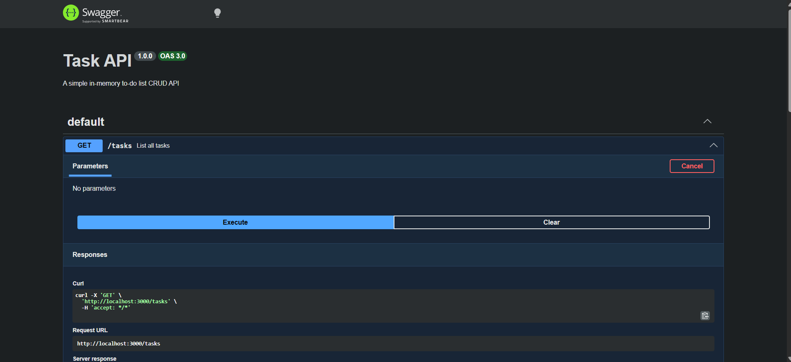
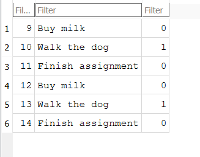

# Task API (SQLite-backed)

A CRUD API for managing a to-do list, built with Node.js and Express, backed by a SQLite database. This is the Week 3 continuation of the FlyRank Backend Track — the same API from Week 1, with in-memory storage replaced by a real database so data survives a server restart. Supports full create, read, update, and delete operations on tasks, with interactive documentation via Swagger UI.

## Why SQLite

SQLite was chosen because it needs no separate server or installation — the entire database is a single file (`tasks.db`) that lives right in the project folder. That makes it ideal for a small project like this: zero setup for anyone who clones the repo, and yet it gives real persistence — tasks created through the API are still there after the server restarts, which was the whole limitation of the in-memory version from Week 1.

## Install & Run

```bash
npm install
node index.js
```

The server starts on `http://localhost:3000`.

On first run, `tasks.db` is created automatically, the `tasks` table is created if it doesn't exist, and three example tasks are seeded — but only if the table is empty, so restarting the server never duplicates them.

## Where the database lives

- File: `tasks.db`, in the project root
- Created automatically the first time the server runs — no manual setup needed
- Git-ignored (see `.gitignore`), so every fresh clone starts with its own clean database, seeded with the same three example tasks

## Endpoints

| Method | Path | Description |
|---|---|---|
| GET | `/` | API info |
| GET | `/health` | Health check |
| GET | `/tasks` | List all tasks |
| GET | `/tasks/:id` | Get one task |
| POST | `/tasks` | Create a task |
| PUT | `/tasks/:id` | Update a task |
| DELETE | `/tasks/:id` | Delete a task |

All endpoints behave identically to the Week 1 in-memory version — only the storage underneath changed, from an in-memory list to SQL queries against `tasks.db`.

## Example Request

```
curl -i -X PUT http://localhost:3000/tasks/4 -H "Content-Type: application/json" -d "{\"done\":true}"
HTTP/1.1 200 OK
X-Powered-By: Express
Content-Type: application/json; charset=utf-8
Content-Length: 47
ETag: W/"2f-AaK7fSPcaFqrubTnTaDKDw/+xaU"
Date: Mon, 17 Aug 2026 10:52:10 GMT
Connection: keep-alive
Keep-Alive: timeout=5

{"id":4,"title":"Test persistence","done":true}
```

## Persistence proof

Unlike the Week 1 version, tasks created here survive a server restart. To verify: create a task, stop the server (`Ctrl+C`), start it again (`node index.js`), then `GET /tasks` — the task is still there.

## Swagger UI

Interactive API docs are available at `http://localhost:3000/docs` once the server is running.

  

## Exploring the database directly

The database can also be opened and queried by hand using [DB Browser for SQLite](https://sqlitebrowser.org/). Because the API and DB Browser read the same `tasks.db` file, changes made in one show up instantly in the other — no syncing, no restart required.





## Notes

- All CRUD operations use parameterized SQL queries (`WHERE id = ?`, never string-concatenated values), which is what protects against SQL injection.
- SQLite stores booleans as `0`/`1` internally; the API converts these to real `true`/`false` in its JSON responses, so clients see the same shape as before.